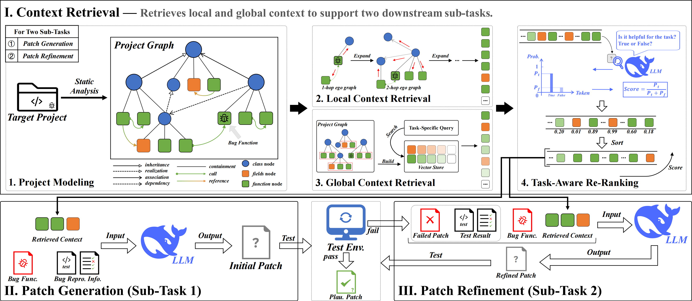

# PSIRepair (Leveraging Project-Specific Information for LLM-Based Automated Program Repair)

## Overview of PSIRepair



**Main Components:**
1. Context Retrieval
    * Local Context Retrieval
    * Global Context Retrieval
    * Task-Aware Re-Ranking
2. Patch Generation (Sub-Task 1)
3. Patch Refinement (Sub-Task 2)

## Preparation
1. Clone Repository
    ```shell
    git clone https://github.com/AnonyRepo25/PSIRepair
    ```

2. Set Up Conda Environment
    * Create: ```conda create --name psirepair python=3.11.9```
    * Install libraries
        * numpy 1.26.4
        * JPype1 1.5.2
        * chardet 5.2.0
        * openai 1.58.1
        * tenacity 9.0.0
        * javalang 0.13.0
        * langchain 0.3.13
        * langchain-openai 0.2.14
        * tqdm 4.66.4
    * See [psirepair_env.yml](./psirepair_env.yml) for details

3. Prepare JDKs
    * Java 7 (for Defects4j V1.2)
    * Java 8 (for Defects4j V2.0)
    * Java 17 (for [Our PG Builder](./PSIRepair/tools/CodeToolkitBackend/src/org/threerepair/CodeToolkitBackend.java))

4. Prepare Benchmarks
    * Install [Defects4J V1.2](https://github.com/rjust/defects4j/releases/tag/v1.2.0)
    * Install [Defects4J V2.0](https://github.com/rjust/defects4j/releases/tag/v2.0.0)
    * Install [Vul4J](https://github.com/tuhh-softsec/vul4j)

5. Prepare Configuration Files
    * Specify the home directories for Java 7, 8, and 17, as well as Defects4J V1.2 and V2.0, in [basic_config.json](./configs/basic_config.json)
    * Configure the LLM and embedding model settings in [llm_config.json](./configs/llm_config.json) and [embedding_model_config.json](./configs/embedding_model_config.json)

## Perform Repair Experiments

To run PSIRepair, execute [psirepair.sh](./psirepair.sh):
```shell
# In PSIRepair root directory
## Select benchmarks to run (choose 1+ from: d4j-v120, d4j-v200, vul4j)
bash psirepair.sh /path/to/output/ --benchmarks d4j-v120 d4j-v200 vul4j
```

All results will be stored in the output directory you specified.

## Online Appendix

### 1. Prompt Template for Context Retrieval

#### 1.1 Re-Ranking Prompt for Patch Generation

```
Given the following buggy method, the triggered failed test method, the failing message, and a code snippet which are bug-free and extracted from the target project to guide the solution.
Before generate the correct method to fix the bug, consider whether the provided code snnipet is helpful for repair the bug.
Your output should JUST be the boolean true or false. Output 'true' if the provided code snippet is helpful, otherwise output 'false'.
Respond with just one word, the 'true' or 'false'. You must output the word 'true', or the word 'false', nothing else.

{bug_method}

{failed_test_method}

{failure_message}

{code_snippet}
```

#### 1.2 Re-Ranking Prompt for Patch Refinement

##### 1.2.1 For Compilation Error

```
Given the following buggy method, the failed fix attempt, and the compilation error log, and a code snippet which are bug-free and extracted from the target project to guide the solution.
Before generate the correct method to pass the compilation and fix the bug, consider whether the provided code snnipet is helpful for resolve the compilation error and fix the bug.
Your output should JUST be the boolean true or false. Output 'true' if the provided code snippet is helpful, otherwise output 'false'.
Respond with just one word, the 'true' or 'false'. You must output the word 'true', or the word 'false', nothing else.

{bug_method}

{failed_fix_attempt}

{compilation_error_log}

{code_snippet}
```

##### 1.2.2 For Test Failure

```
Given the following buggy method, the failed fix attempt, the failed test method, and the test failure log, and a code snippet which are bug-free and extracted from the target project to guide the solution.
Before generate the correct method to pass the test and fix the bug, consider whether the provided code snnipet is helpful for resolve the test failure and fix the bug.
Your output should JUST be the boolean true or false. Output 'true' if the provided code snippet is helpful, otherwise output 'false'.
Respond with just one word, the 'true' or 'false'. You must output the word 'true', or the word 'false', nothing else.

{bug_method}

{failed_fix_attempt}

{failed_test_method}

{test_failure_log}

{code_snippet}
```

### 2. Prompt Template for Patch Generation

````
Given the following buggy method, the triggered failed test method, and the failing message, please generate the correct full method to fix the bug.
Use a Java code block to write your response. For example:
```java
public static int sum(int a, int b) {
    return a + b;
}
```

{bug_method}

{failed_test_method}

{failure_message}

Additionally, you can refer to the following code snippets which are bug-free and extracted from the target project to guide the solution:
{code_snippets}
````

### 3. Prompt Template for Patch Refinement

##### 3.1 For Compilation Error

````
Given the following buggy method, the failed fix attempt, and the compilation error log, please generate the correct full method to pass the compilation and fix the bug.
Use a Java code block to write your response. For example:
```java
public static int sum(int a, int b) {
    return a + b;
}
```

{bug_method}

{failed_fix_attempt}

{compilation_error_log}

Additionally, you can refer to the following code snippets which are bug-free and extracted from the target project to guide the solution:
{code_snippets}
````

##### 3.2 For Test Failure

````
Given the following buggy method, the failed fix attempt, the failed test method, and the test failure log, please generate the correct full method to pass the test and fix the bug.
Use a Java code block to write your response. For example:
```java
public static int sum(int a, int b) {
    return a + b;
}
```

{bug_method}

{failed_fix_attempt}

{failed_test_method}

{test_failure_log}

Additionally, you can refer to the following code snippets which are bug-free and extracted from the target project to guide the solution:
{code_snippets}
````
